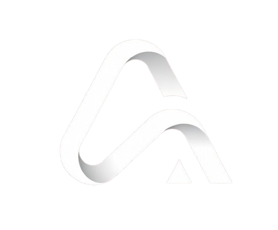
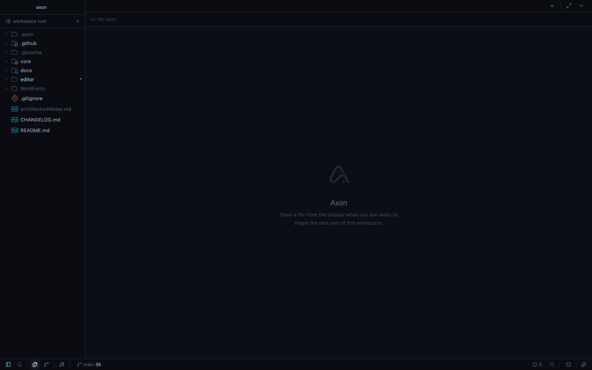
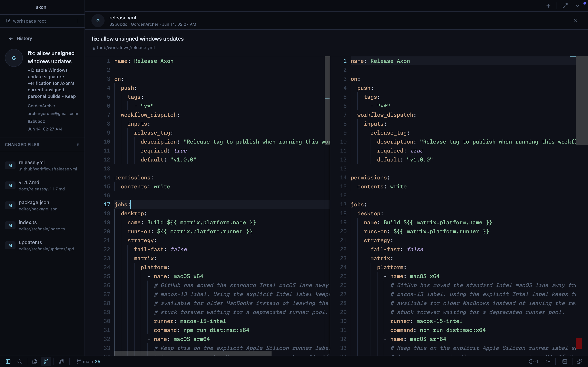
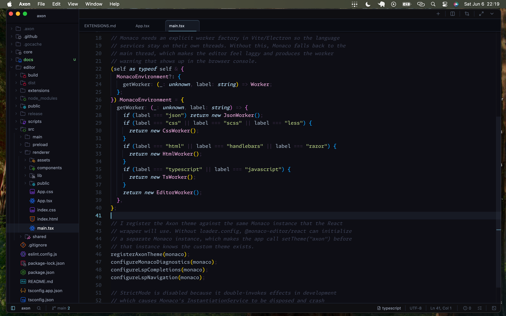
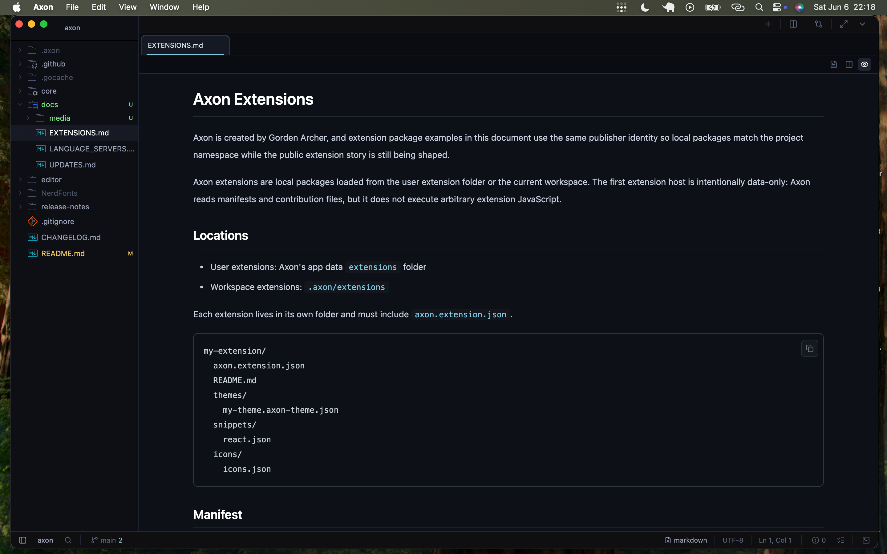
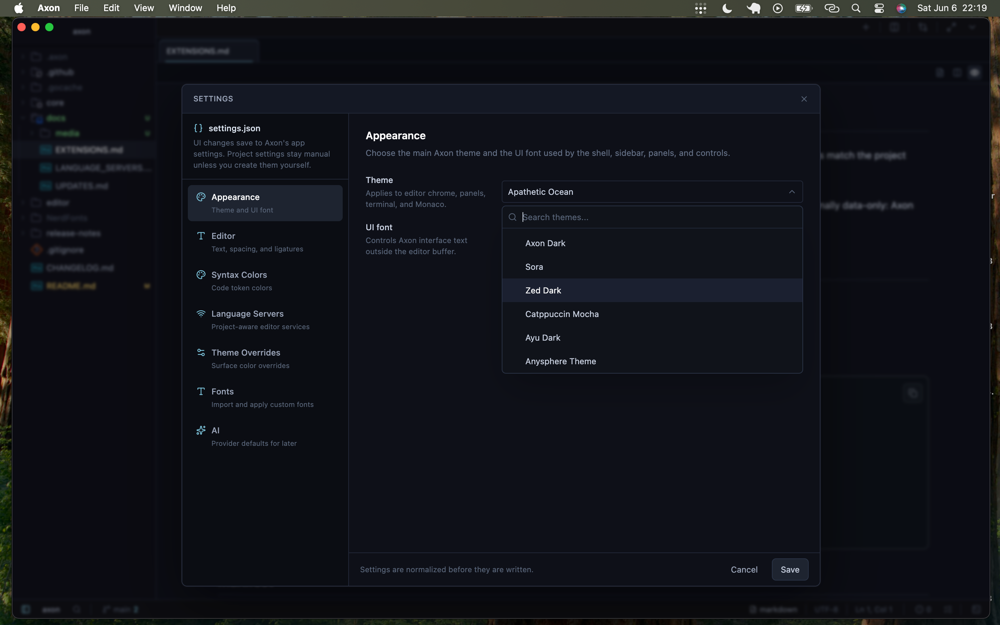
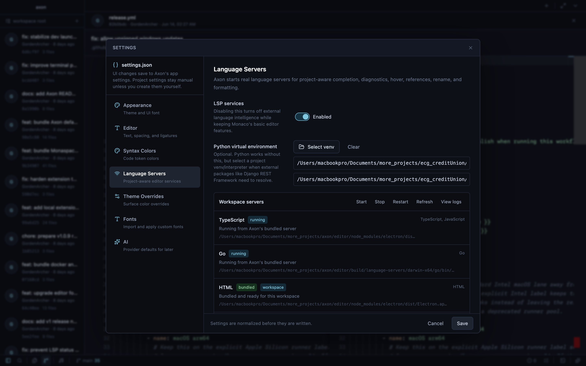
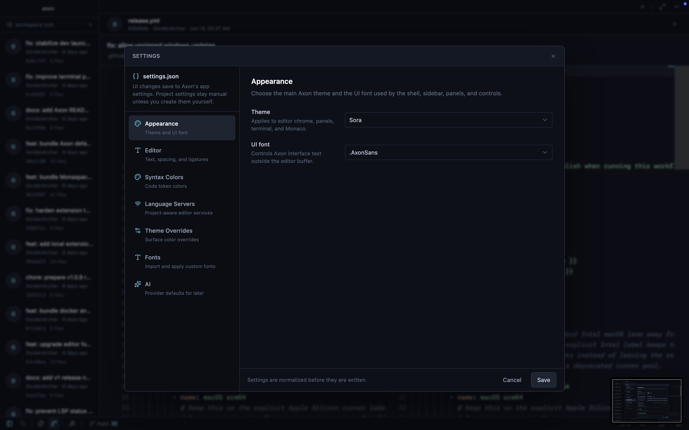
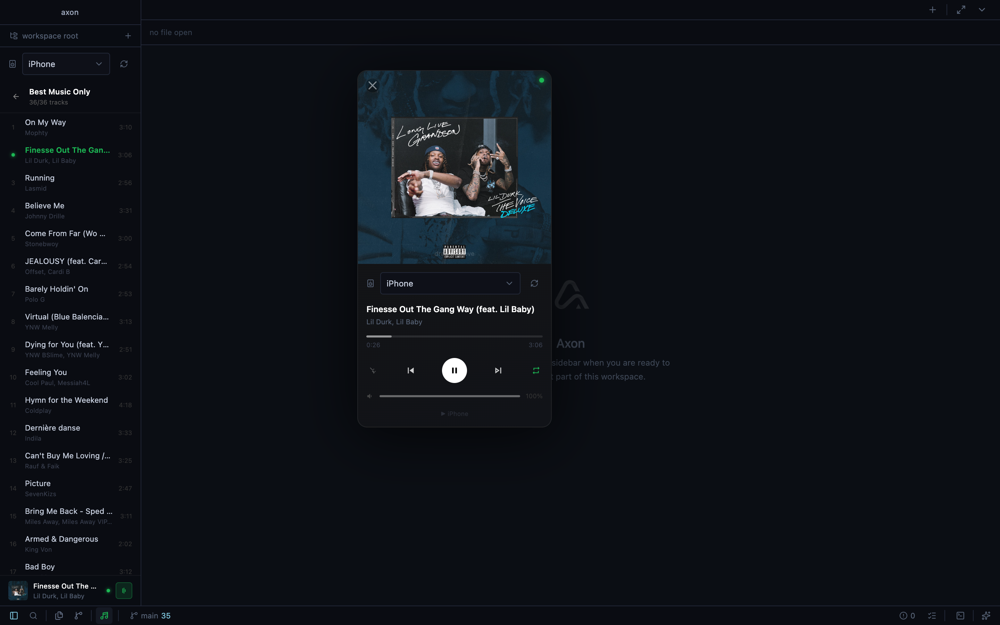
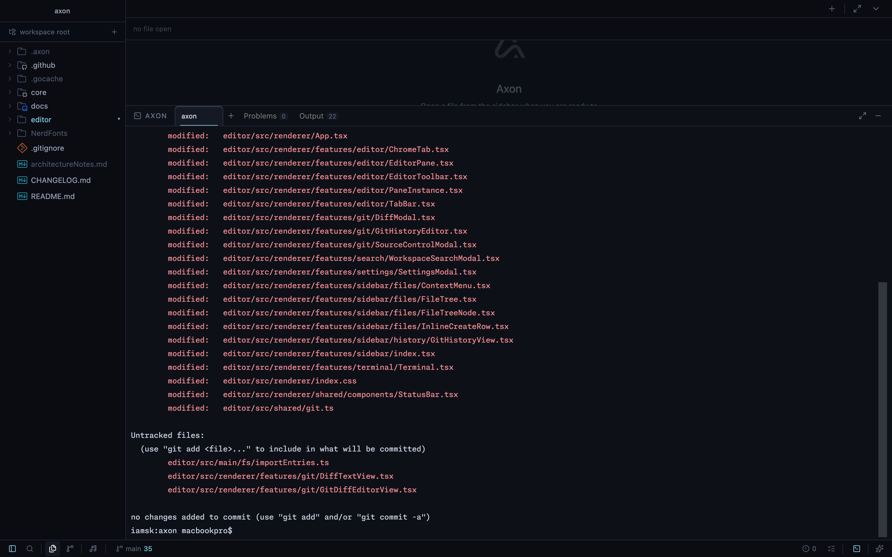

# Axon

<p align="center">
  
</p>

Axon is a personal AI-powered code editor built with Electron, React, TypeScript,
Monaco, and a Go backend. It is built for day-to-day coding first: files,
panes, terminal, Git, search, settings, previews, and language-server support.

## Preview

**Quick look**

<p align="center">
  
</p>

**Full demo**

<p align="center">
  <video src="docs/media/axon-demo-full.mp4" controls width="760">
    Axon demo recording.
  </video>
</p>

**Screenshots**

<table>
  <tr>
    <td colspan="3" align="center"><strong>Workspace and Navigation</strong></td>
  </tr>
  <tr>
    <td align="center">
      <br />
      <sub>Empty workspace</sub>
    </td>
    <td align="center">
      <br />
      <sub>File tree and tabs</sub>
    </td>
    <td align="center">
      <br />
      <sub>Command palette</sub>
    </td>
  </tr>
  <tr>
    <td colspan="3" align="center"><strong>Git and Review</strong></td>
  </tr>
  <tr>
    <td align="center">
      <br />
      <sub>Source control</sub>
    </td>
    <td align="center">
      <br />
      <sub>Side-by-side diff</sub>
    </td>
    <td align="center">
      <br />
      <sub>Language servers</sub>
    </td>
  </tr>
  <tr>
    <td colspan="3" align="center"><strong>Customization and Tools</strong></td>
  </tr>
  <tr>
    <td align="center">
      <br />
      <sub>Appearance settings</sub>
    </td>
    <td align="center">
      <br />
      <sub>Spotify player</sub>
    </td>
    <td align="center">
      <br />
      <sub>Terminal panel</sub>
    </td>
  </tr>
</table>

## Stack

**Editor**
- Electron desktop shell
- React, TypeScript, Tailwind CSS
- Monaco Editor
- xterm.js terminal

**Core**
- Go HTTP server on `localhost:7777`
- File system, workspace search, Git, terminal PTY, and future AI routes

## Project Structure

```text
axon/
├── core/                         # Go backend
│   ├── cmd/axon/                 # backend entry point
│   └── internal/
│       ├── fs/                   # file tree, text reads, writes, search
│       ├── server/               # HTTP routes
│       ├── terminal/             # PTY + websocket bridge
│       └── ai/                   # future AI backend surface
├── editor/                       # Electron + React app
│   └── src/
│       ├── main/                 # Electron main process, IPC, updater, LSP
│       ├── preload/              # safe contextBridge API
│       └── renderer/             # Axon UI
└── docs/                         # release, update, and LSP notes
```

## Run Locally

```bash
cd core
go run cmd/axon/main.go
```

```bash
cd editor
npm install
npm run build:main
npm run dev
```

In development, the Electron app expects the Go core to be running on
`localhost:7777`. Packaged builds include the Go core binary and start it
automatically.

## Build

```bash
cd editor
npm run build
npm run pack
```

Platform packages:

```bash
npm run dist:mac
npm run dist:win
npm run dist:linux
```

Build output goes to `editor/release/`.

## Downloads

Use the file that matches your platform and CPU:

- macOS Apple Silicon: `Axon-<version>-arm64.dmg`
- macOS Intel: `Axon-<version>.dmg`
- Windows: `Axon.Setup.<version>.exe`
- Linux AppImage: `Axon-<version>.AppImage`
- Linux Debian/Ubuntu: `axon_<version>_amd64.deb`

If macOS says the app is not supported, the downloaded build probably does not
match your CPU architecture.

## Updates

Axon checks GitHub releases for newer versions. On unsigned personal macOS
builds, fully automatic in-app replacement is not guaranteed because macOS
Gatekeeper and Electron updater flows expect signed/notarized apps for the
smoothest install-and-relaunch path. For that reason, the safest update path is:

1. Open the update notice in Axon.
2. Download the correct release artifact for your platform.
3. Replace the old app manually if the in-app updater cannot relaunch.

Windows and Linux builds do not require Apple notarization, but releases still
need to be tested on their target platform before being treated as stable.

More detail: [docs/UPDATES.md](docs/UPDATES.md).

## Current Features

- Real folder/workspace opening
- Lazy file tree with Git colors and ignored-path handling
- Split panes, draggable tabs, dirty indicators, and close prompts
- Shared Monaco models across panes
- Markdown preview and HTML preview
- Image/video preview through Axon protocols
- Workspace search with jump-to-line and binary/cache exclusions
- Cmd+P project file search with file-first results and `>` command search
- Source control modal, diffs, Git gutter markers, branch/stash workflows,
  conflict helpers, worktree management, and commit graph preview
- Problems panel with project-aware LSP diagnostics and copy actions
- Test explorer with provider discovery, target runs, and inline output
- Integrated terminal with tabs
- Settings UI and settings JSON
- Custom themes, theme overrides, and imported fonts
- Splash screen and custom app icon/name
- LSP completion for TypeScript/JavaScript, Go, Python, Rust, C/C++, Java, C#,
  Kotlin, PHP, Lua, Docker, and Tailwind CSS
- Language tools modal for definition, references, rename, formatting, server
  status, and file symbols
- Live LSP diagnostics routed into Problems

## Language Servers

Axon does not reimplement language intelligence itself. Like Zed and VS Code, it
acts as an LSP client and talks to language servers.

Currently targeted:

- TypeScript/JavaScript: bundled `typescript-language-server`
- Go: managed `gopls` bundle path
- Python: bundled `pyright-langserver`
- Rust: managed `rust-analyzer` bundle path
- C/C++: managed `clangd` bundle path
- Java: managed `jdtls` bundle path
- C#: managed OmniSharp/C# bundle path
- Kotlin: managed `kotlin-language-server` bundle path
- PHP: bundled `intelephense`
- Lua: managed `lua-language-server` bundle path

Release builds download the native managed servers on the GitHub runner for
that platform, then package them inside the desktop app. A GitHub release asset
therefore already contains its matching server bundle; the app does not download
those servers again on the user's machine. Source checkouts keep those generated
binaries ignored, so local development uses `npm run build:language-servers`
when a fresh bundle is needed.

More detail: [docs/LANGUAGE_SERVERS.md](docs/LANGUAGE_SERVERS.md).

## Release Notes

See [CHANGELOG.md](CHANGELOG.md).

## Roadmap

- Workspace replace
- AI provider service and streaming chat panel
- AI patch preview/apply workflow
- Plugin/extension architecture
